# Agricultural FinTech Data Analysis and Forecast

> This is the project I have completed when I was studying in Financial Market Data Design and Analysis Course at UNSW.
> The product is a finance-based product that provides business insights to add value to the clients. The product will utilise various data sources, including a corn and wheat price database, and client relevant news, to generate meaningful insights for clients
> The product is designed for small and medium sized businesses, and can be used to track a variety of financial metrics, including:
> * Market price
> * Trading Volume
> * Sentiment Trend

### Input Data
The input data consists of 5 database i.e., 2 excel sheets, and 1 json file:
1. Wheat trading data from 1 August 2018 to 31 July 2020
2. Corn trading data from 1 August 2018 to 31 July 2020
3. Relevant news data in json format

## Data Cleaning
The input data has to be checked and cleaned before analysis

The weather database has some blanks space which needs estimation to fill the space. The blank space needs to respect the original data type of each section. The wind speed column has some rows labelled as Calm. I assume that this means the wind speed is 0. This needs to be converted to 0 in order to maintain the data type as integer.

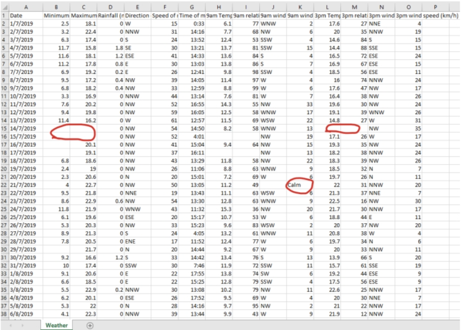

I then changed all column names by removing all whitespaces, and converted dates into a correct format.
The corn and wheat price history datasets are treated in the same way. To make them suitable for analysis with python code, I have removed unnecessary data like last price, bid and ask price, and open Interest. I also sort the data rows in ascending order based on dates using python, [reverse_row.py](Analysis/reverse_row.py). The processed dataset is saved as new files.

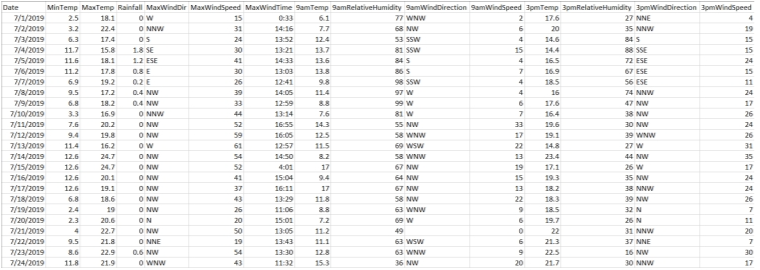


## Analysis Model Design
I have designed a model that uses the ARIMA model to forecast the price and contract volume of both corn and wheat contracts. I will use historical data of the corn and wheat contract retrieved from the earlier station as a source of price and volume forecast.
In addition to the ARIMA model, I will also use VADER to perform sentiment analysis on commodity news. This will allow me to return the sentiment of each contract, whether it is negative or positive.

### Price and Trading Volume Forecast with ARIMA Model

Putting ARIMA model into implementation. The model forecasts the following values based on different inputs.
* st: This parameter specifies the number of forecasted values the model will generate. For instance, if st = 7, the model will produce a forecast for the next 7 time periods. In our context of daily data, this would correspond to a 7-day forecast, with each value representing the predicted price or volume for each of those days.
* display_range: This parameter defines the range of historical data to include in the output alongside the forecasted values. By incorporating recent historical data in the displayed chart, users can observe a comprehensive view of both the past trends and the forecast.
```
def Station3_ARIMAForecast(df, p, d, q, st, display_range):
    model = ARIMA(df, order=(p, d, q))
    forecast_arima = model.fit().forecast(steps=st).round(4)
    last_date = df.index[-1]
    forecast_index = pd.date_range(start=last_date + pd.DateOffset(), periods=st)
    forecast_series = pd.Series(forecast_arima.values, index=forecast_index)
    forecast_arima = pd.concat([df[-display_range:], forecast_series])
    return forecast_arima

# ARIMA Price prediction
corn_price_arima_forecast_7days = Station3_ARIMAForecast(corn_price_df['Settlement Price'], 7, 1, 30, 7, 30)
corn_price_arima_forecast_14days = Station3_ARIMAForecast(corn_price_df['Settlement Price'], 14, 1, 30, 14, 60)
corn_price_arima_forecast_1month = Station3_ARIMAForecast(corn_price_df['Settlement Price'], 30, 1, 30, 30, 90)
corn_price_arima_forecast_3months = Station3_ARIMAForecast(corn_price_df['Settlement Price'], 90, 1, 30, 90, 180)
wheat_price_arima_forecast_7days = Station3_ARIMAForecast(wheat_price_df['Settlement Price'], 7, 1, 30, 7, 30)
wheat_price_arima_forecast_14days = Station3_ARIMAForecast(wheat_price_df['Settlement Price'], 14, 1, 30, 14, 60)
wheat_price_arima_forecast_1month = Station3_ARIMAForecast(wheat_price_df['Settlement Price'], 30, 1, 30, 30, 90)
wheat_price_arima_forecast_3months = Station3_ARIMAForecast(wheat_price_df['Settlement Price'], 90, 1, 30, 90, 180)

# ARIMA Trading Volume prediction
corn_volume_arima_forecast_7days = Station3_ARIMAForecast(corn_price_df['CVol'], 7, 1, 30, 7, 30)
corn_volume_arima_forecast_14days = Station3_ARIMAForecast(corn_price_df['CVol'], 14, 1, 30, 14, 60)
corn_volume_arima_forecast_1month = Station3_ARIMAForecast(corn_price_df['CVol'], 30, 1, 30, 30, 90)
corn_volume_arima_forecast_3months = Station3_ARIMAForecast(corn_price_df['CVol'], 90, 1, 30, 90, 180)
wheat_volume_arima_forecast_7days = Station3_ARIMAForecast(wheat_price_df['CVol'], 7, 1, 30, 7, 30)
wheat_volume_arima_forecast_14days = Station3_ARIMAForecast(wheat_price_df['CVol'], 14, 1, 30, 14, 60)
wheat_volume_arima_forecast_1month = Station3_ARIMAForecast(wheat_price_df['CVol'], 30, 1, 30, 30, 90)
wheat_volume_arima_forecast_3months = Station3_ARIMAForecast(wheat_price_df['CVol'], 90, 1, 30, 90, 180)
```

This section displays the average return forecast for each product at different period.
```
def Station4_ReturnForecast(current_price, fc1_price, fc2_price, fc3_price, fc4_price, topic, fc_period_list):
    fc1_ret = (fc1_price - current_price) / current_price * 100
    fc2_ret = (fc2_price - current_price) / current_price * 100
    fc3_ret = (fc3_price - current_price) / current_price * 100
    fc4_ret = (fc4_price - current_price) / current_price * 100
    print(f"{topic} {fc_period_list[0]} return: {fc1_ret.round(2)}%")
    print(f"{topic} {fc_period_list[1]} return: {fc2_ret.round(2)}%")
    print(f"{topic} {fc_period_list[2]} return: {fc3_ret.round(2)}%")
    print(f"{topic} {fc_period_list[3]} return: {fc4_ret.round(2)}%")

# Return forecast in %
Station4_ReturnForecast(corn_price_df['Settlement Price'][-1], corn_price_arima_forecast_7days[-1],
    corn_price_arima_forecast_14days[-1], corn_price_arima_forecast_1month[-1],
    corn_price_arima_forecast_3months[-1], 'Corn', ['7 days', '14 days', '1 month', '3 months'])
Station4_ReturnForecast(wheat_price_df['Settlement Price'][-1], wheat_price_arima_forecast_7days[-1],
    wheat_price_arima_forecast_14days[-1], wheat_price_arima_forecast_1month[-1],
    wheat_price_arima_forecast_3months[-1], 'Wheat', ['7 days', '14 days', '1 month', '3 months'])
```

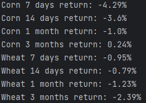

### Sentiment Forecast with VADER Model
Preparing the data by separating news of corn and wheat to different DataFrames
```
def Station2_relevant_news(news_df, text):
    df = pd.DataFrame()
    selected_rows = news_df[news_df['Headline'].str.contains(text, case=False)]
    df = df.append(selected_rows, ignore_index=True)
    return df

# Separate Corn and Wheat news
corn_news_df = Station2_relevant_news(news_df, 'corn')
wheat_news_df = Station2_relevant_news(news_df, 'wheat')
```

Putting VADER model into implementation. The model analyses and converts text into numeric value incidating whether the text is positive or negative.
The values is then put into ARIMA model for further forecast.
```
def Station3_VADER(df):
    # Instantiate the sentiment intensity analyzer
    vader = SentimentIntensityAnalyzer()

    # Iterate through the headlines and get the polarity scores using vader
    scores = df['Headline'].apply(vader.polarity_scores).tolist()
    # Convert the 'scores' list of dicts into a DataFrame
    scores_df = pd.DataFrame(scores)

    # Join the DataFrames of the news and the list of dicts
    df = df.join(scores_df, rsuffix='_right')

    # Group by date and ticker columns from scored_news and calculate the mean
    date_format = '%A, %B %d, %Y %I:%M:%S %p (GMT)'
    df.index = pd.to_datetime(df['Date'], format=date_format)
    df = df.drop(columns=['Date'])
    mean_scores = df.groupby(['Date']).mean()

    return mean_scores

 # VADER Sentiment analysis
corn_mean_sentiment_score = Station3_VADER(corn_news_df)
wheat_mean_sentiment_score = Station3_VADER(wheat_news_df)

# Sentiment Prediction
corn_sentiment_forecast_3days = Station3_ARIMAForecast(corn_mean_sentiment_score['compound'], 3, 1, 30, 3, 14)
corn_sentiment_forecast_7days = Station3_ARIMAForecast(corn_mean_sentiment_score['compound'], 7, 1, 30, 7, 14)
corn_sentiment_forecast_14days = Station3_ARIMAForecast(corn_mean_sentiment_score['compound'], 14, 1, 30, 14, 30)
corn_sentiment_forecast_1month = Station3_ARIMAForecast(corn_mean_sentiment_score['compound'], 30, 1, 30, 30, len(corn_mean_sentiment_score))
wheat_sentiment_forecast_3days = Station3_ARIMAForecast(wheat_mean_sentiment_score['compound'], 3, 1, 30, 3, 14)
wheat_sentiment_forecast_7days = Station3_ARIMAForecast(wheat_mean_sentiment_score['compound'], 7, 1, 30, 7, 14)
wheat_sentiment_forecast_14days = Station3_ARIMAForecast(wheat_mean_sentiment_score['compound'], 14, 1, 30, 14, 30)
wheat_sentiment_forecast_1month = Station3_ARIMAForecast(wheat_mean_sentiment_score['compound'], 30, 1, 30, 30, len(wheat_mean_sentiment_score))
```

This section displays the average sentiment result for each display period to give user an overview of the product for different period of time, similarly to company stocks.
```
def Station4_MeanSentiment(compound_data, topic, average_period_list, display_period_list):
    mean_value1 = compound_data[-average_period_list[0]:].mean()
    result1 = 'Neutral'
    if mean_value1 > 0:
        result1 = 'Positive'
    elif mean_value1 < 0:
        result1 = 'Negative'
    mean_value2 = compound_data[-average_period_list[1]:].mean()
    result2 = 'Neutral'
    if mean_value2 > 0:
        result2 = 'Positive'
    elif mean_value2 < 0:
        result2 = 'Negative'
    mean_value3 = compound_data[-average_period_list[2]:].mean()
    result3 = 'Neutral'
    if mean_value3 > 0:
        result3 = 'Positive'
    elif mean_value3 < 0:
        result3 = 'Negative'
    mean_value4 = compound_data[-average_period_list[3]:].mean()
    result4 = 'Neutral'
    if mean_value4 > 0:
        result4 = 'Positive'
    elif mean_value4 < 0:
        result4 = 'Negative'
    mean_value5 = compound_data[:].mean()
    result5 = 'Neutral'
    if mean_value5 > 0:
        result5 = 'Positive'
    elif mean_value5 < 0:
        result5 = 'Negative'

    print(f"{topic} for the {display_period_list[0]} is {result1} ({mean_value1.round(4)})")
    print(f"{topic} for the {display_period_list[1]} is {result2} ({mean_value2.round(4)})")
    print(f"{topic} for the {display_period_list[2]} is {result3} ({mean_value3.round(4)})")
    print(f"{topic} for the {display_period_list[3]} is {result4} ({mean_value4.round(4)})")
    print(f"{topic} for the {display_period_list[4]} is {result4} ({mean_value5.round(4)})")

# Sentiment Analysis mean
Station4_MeanSentiment(corn_mean_sentiment_score['compound'].values, 'Corn Sentiment', [3, 7, 14, 30],
    ['last 3 Days', 'last 7 days', 'last 14 days', 'last 1 month', 'the whole data period'])
Station4_MeanSentiment(wheat_mean_sentiment_score['compound'].values, 'Wheat Sentiment', [3, 7, 14, 30],
    ['last 3 Days', 'last 7 days', 'last 14 days', 'last 1 month', 'the whole data period'])
```


## Analysis Model Implementation
The code for all stages is in [assignment_data_process.py](Analysis/assignment_data_process.py)
* Price and contract volume forecasts: The application will make forecasts for 4 ranges of time: 7 days, 14 days, 1 month, 3 months. This will allow users to make informed decisions according to their trading strategies.
* Sentiment analysis: The application will also provide sentiment analysis of news related to agricultural commodities futures contracts. There will be 4 ranges of forecast period: 3 day, 7 days, 14 days, and 1 month. This information will help users to understand the market sentiment and make informed trading decisions.

Line and Bar plot are used to display the past and forecast data. The function is dynamic and flexible as it takes any 4 plots into display. This will be used multiple times throughout the section
```
def Station4_ARIMALinePlot(fc1, fc2, fc3, fc4, display_list, forecast_topic, forecast_period_list):
    fig, axs = plt.subplots(2, 2, figsize=(15, 10), sharey=True)
    axs[0, 0].plot(fc1.index[:display_list[0]], fc1.values[:display_list[0]],
                   color='midnightblue')
    axs[0, 0].plot(fc1.index[display_list[0]:], fc1.values[display_list[0]:], color='red')
    axs[0, 0].set_xlabel('Date')
    axs[0, 0].set_ylabel('Price')
    axs[0, 0].set_title(f'{forecast_topic} Forecast for {forecast_period_list[0]}')
    axs[0, 1].plot(fc2.index[:display_list[1]], fc2.values[:display_list[1]],
                   color='midnightblue')
    axs[0, 1].plot(fc2.index[display_list[1]:], fc2.values[display_list[1]:],
                   color='red')
    axs[0, 1].set_xlabel('Date')
    axs[0, 1].set_ylabel('Price')
    axs[0, 1].set_title(f'{forecast_topic} Forecast for {forecast_period_list[1]}')
    axs[1, 0].plot(fc3.index[:display_list[2]], fc3.values[:display_list[2]],
                   color='midnightblue')
    axs[1, 0].plot(fc3.index[display_list[2]:], fc3.values[display_list[2]:],
                   color='red')
    axs[1, 0].set_xlabel('Date')
    axs[1, 0].set_ylabel('Price')
    axs[1, 0].set_title(f'{forecast_topic} Forecast for {forecast_period_list[2]}')
    axs[1, 1].plot(fc4.index[:display_list[3]], fc4.values[:display_list[3]],
                   color='midnightblue')
    axs[1, 1].plot(fc4.index[display_list[3]:], fc4.values[display_list[3]:],
                   color='red')
    axs[1, 1].set_xlabel('Date')
    axs[1, 1].set_ylabel('Price')
    axs[1, 1].set_title(f'{forecast_topic} Forecast for {forecast_period_list[3]}')
    plt.tight_layout()
    plt.show()


def Station4_ARIMABarPlot(fc1, fc2, fc3, fc4, display_list, forecast_topic, forecast_period_list):
    fig, axs = plt.subplots(2, 2, figsize=(15, 10), sharey=True)
    axs[0, 0].bar(fc1.index[:display_list[0]], fc1.values[:display_list[0]],
                  color='midnightblue')
    axs[0, 0].bar(fc1.index[display_list[0]:], fc1.values[display_list[0]:], color='red')
    axs[0, 0].set_xlabel('Date')
    axs[0, 0].set_ylabel('Price')
    axs[0, 0].set_title(f'{forecast_topic} Forecast for {forecast_period_list[0]}')
    axs[0, 1].bar(fc2.index[:display_list[1]], fc2.values[:display_list[1]],
                  color='midnightblue')
    axs[0, 1].bar(fc2.index[display_list[1]:], fc2.values[display_list[1]:],
                  color='red')
    axs[0, 1].set_xlabel('Date')
    axs[0, 1].set_ylabel('Price')
    axs[0, 1].set_title(f'{forecast_topic} Forecast for {forecast_period_list[1]}')
    axs[1, 0].bar(fc3.index[:display_list[2]], fc3.values[:display_list[2]],
                  color='midnightblue')
    axs[1, 0].bar(fc3.index[display_list[2]:], fc3.values[display_list[2]:],
                  color='red')
    axs[1, 0].set_xlabel('Date')
    axs[1, 0].set_ylabel('Price')
    axs[1, 0].set_title(f'{forecast_topic} Forecast for {forecast_period_list[2]}')
    axs[1, 1].bar(fc4.index[:display_list[3]], fc4.values[:display_list[3]],
                  color='midnightblue')
    axs[1, 1].bar(fc4.index[display_list[3]:], fc4.values[display_list[3]:],
                  color='red')
    axs[1, 1].set_xlabel('Date')
    axs[1, 1].set_ylabel('Price')
    axs[1, 1].set_title(f'{forecast_topic} Forecast for {forecast_period_list[3]}')
    plt.tight_layout()
    plt.show()
```

### Step took when implementing this solution
#### ARIMA Model
1. Testing the model if it can successfully return the forecasts.
2. Try different forecast periods, assess the differences.
3. Determine the final forecast period.
4. Run the forecast for different forecast periods on each asset.
5. Combine the current and forecast data.
6. Display as line/bar plots with different colours.

> [!TIP]
> Past data is in Blue and Forecast data is in Red

Price forecast for corn and wheat contracts
```
# ARIMA Price Forecast line plots
Station4_ARIMALinePlot(corn_price_arima_forecast_7days, corn_price_arima_forecast_14days,
  corn_price_arima_forecast_1month, corn_price_arima_forecast_3months,
  [30, 60, 90, 180], 'Corn Settlement Price', ['7 days', '14 days', '1 month', '3 months'])
Station4_ARIMALinePlot(wheat_price_arima_forecast_7days, wheat_price_arima_forecast_14days,
  wheat_price_arima_forecast_1month, wheat_price_arima_forecast_3months,
  [30, 60, 90, 180], 'Wheat Settlement Price', ['7 days', '14 days', '1 month', '3 months'])
```

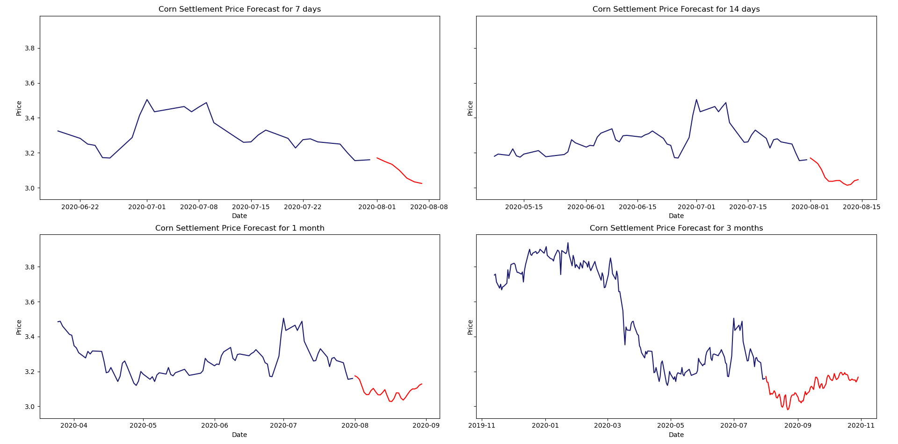 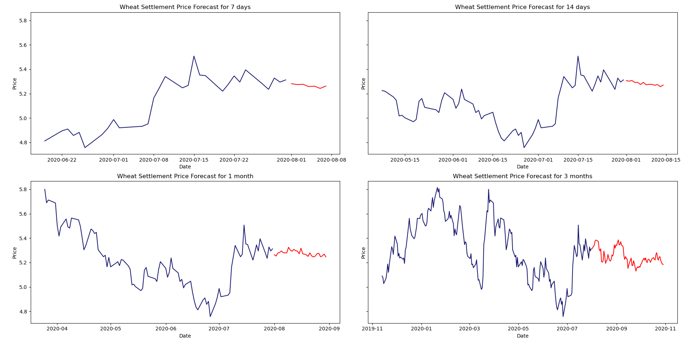

Volume forecast for corn and wheat contracts
```
# ARIMA Trading Volume Forecast bar plots
Station4_ARIMABarPlot(corn_volume_arima_forecast_7days, corn_volume_arima_forecast_14days,
  corn_volume_arima_forecast_1month, corn_volume_arima_forecast_3months,
  [30, 60, 90, 180], 'Corn Trading Volume', ['7 days', '14 days', '1 month', '3 months'])
Station4_ARIMABarPlot(wheat_volume_arima_forecast_7days, wheat_volume_arima_forecast_14days,
  wheat_volume_arima_forecast_1month, wheat_volume_arima_forecast_3months,
  [30, 60, 90, 180], 'Wheat Trading Volume', ['7 days', '14 days', '1 month', '3 months'])
```

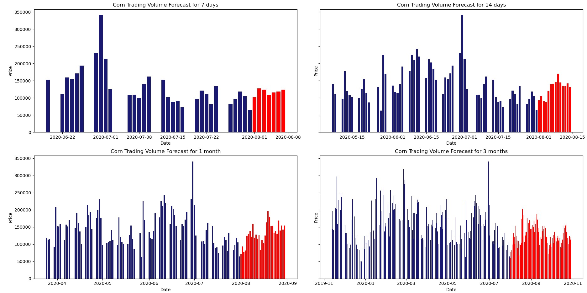 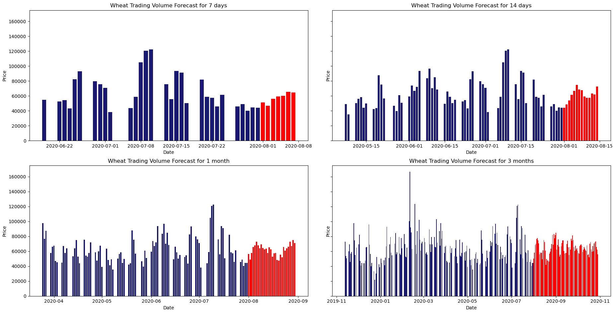

#### VADER
1. Separate the news of different commodities so run the sentiment analysis separately.
2. Test the model if it can produce the sentiment analysis on the given dataset.
3. Put the output of the sentiment analysis in the ARIMA model to forecast the compound section of the output.
4. Try different forecast periods, assess the differences.
5. Determine the final forecast period.
6. Combine the current and forecast data.
7. Display as line plots with different colours. (See figure 5 and 6 in appendix)

Sentiment forecast for corn and wheat contracts
```
# ARIMA Sentiment Forecast line plots
Station4_ARIMALinePlot(corn_sentiment_forecast_3days, corn_sentiment_forecast_7days, corn_sentiment_forecast_14days, corn_sentiment_forecast_1month,
    [14, 14, 30, len(corn_mean_sentiment_score)], 'Corn Sentiment', ['3 Days', '7 days', '14 days', '1 month'])
Station4_ARIMALinePlot(wheat_sentiment_forecast_3days, wheat_sentiment_forecast_7days, wheat_sentiment_forecast_14days, wheat_sentiment_forecast_1month,
    [14, 14, 30, len(corn_mean_sentiment_score)], 'Wheat Sentiment', ['3 Days', '7 days', '14 days', '1 month'])
```

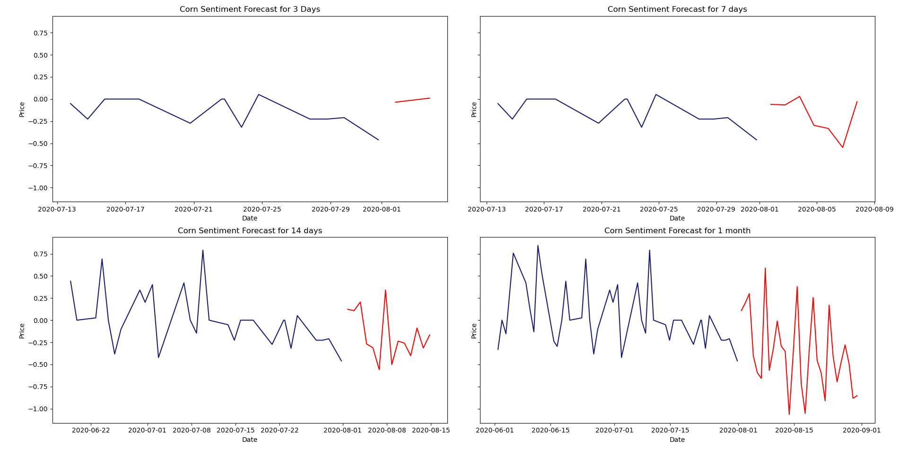 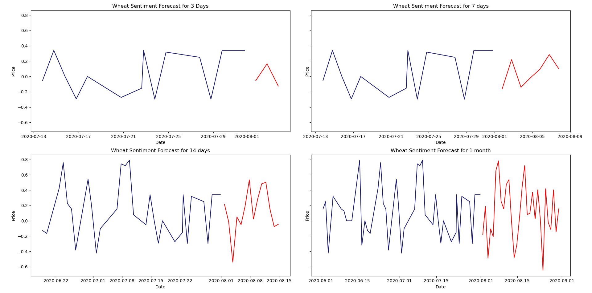

### Encountered difficulties
* There are numerous options for setting the input parameters of the ARIMA model, namely p, d, and q variables. This abundance of choices makes it challenging to determine the optimal combination that provides the best results.
* The sentiment analysis results are challenging to present as the sentiment scores are mostly less than 0.1. They are considered to be neutral, so it is difficult to determine whether the news articles are positive or negative. At the moment, I have decided to simply present the results as an overview of whether the sentiment is positive or negative for the given period of time.


## FIGMA design
The interface of the application is designed in FIGMA for both website and mobile version. The FIGMA design includes login/sign up page, homepage, profile page, and analysis page for price, contract volume, and sentiment forecast at different forecast periods.
This can be accessed via the [FIGMA](https://www.figma.com/file/j0GcdR4IDo2vSibD7M04Kd/Untitled?type=design&node-id=103%3A22529&mode=design&t=LJ0NY9PEIgsguUU8-1/) link

### Desktop Version 

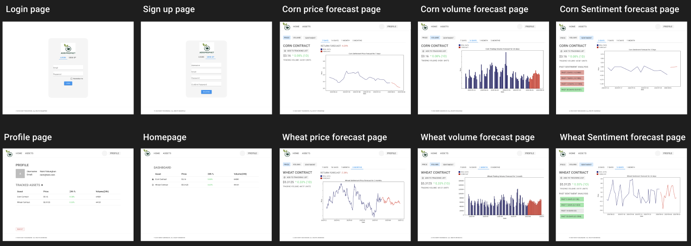

### Mobile Version 

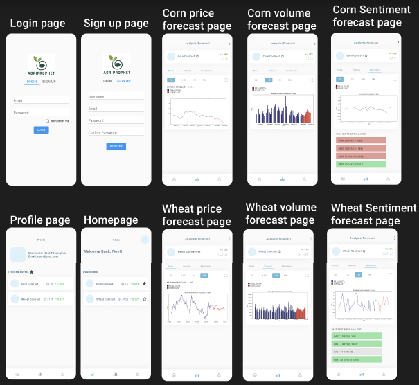
